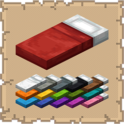

# Bee GUI

  

   
A simple mod that adds flat, floor-level beds in all colors so you can sleep through the night without changing your spawn point.

## Functionality

  

   
- **16 Colors**: One craftable variant per wool color.
- **Flat Design**: 16×4×16, no bed frame or legs.
- **No Spawn Override**: Skips the night without changing your spawn point.
- **Explodes in Nether/End**: Same behavior as vanilla beds.
- **No Explosion Drop**: Destroyed by explosions without dropping the item.
- **Wool Sounds**: Soft sounds for all interactions.
- **Custom Breaking Speed**: Faster with shears; supports Efficiency and Haste.
- **Stackable to 64**: Unlike vanilla beds.

## Benefits

  

   
- Skip the night without losing your set spawn point
- All 16 wool colors available
- Flat 16×4×16 collision shape — no bulky bed frame
- Soft wool-like sounds when placing, breaking, and walking on them
- Custom breaking speeds — faster with shears, supports Efficiency and Haste
- Stackable to 64
- Fully integrated into the Functional Blocks and Colored Blocks creative tabs

## Installation

  

   
1.  **Requirements**: Ensure you have Minecraft 1.21.10, Fabric Loader 0.18.4, and the Fabric API installed.
2.  **Download**: Get the latest `.jar` from [Modrinth](https://modrinth.com/mod/floor-beds) or [CurseForge](https://www.curseforge.com/minecraft/mc-mods/floor-beds).
3.  **Setup**: Drop the file into your `%appdata%/.minecraft/mods` folder.

## Support

  

   
If you encounter bugs or wish to contribute:
* [Report any problems you find.](https://github.com/armaninyow/Floor-Beds/discussions/categories/issues)
* [Share your ideas for new features.](https://github.com/armaninyow/Floor-Beds/discussions/categories/suggestions)

## Credits

  

   
* **Author**: Armaninyow
* **License**: Released under [CC0-1.0](https://creativecommons.org/publicdomain/zero/1.0/).

