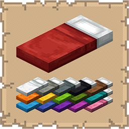

# Floor Beds

## Installation
   
* [Modrinth](https://modrinth.com/mod/floor-beds)
* [CurseForge](https://www.curseforge.com/minecraft/mc-mods/floor-beds)

## Support
   
If you encounter bugs or wish to contribute:
* [Report any problems you find.](https://github.com/armaninyow/Floor-Beds/discussions/categories/issues)
* [Share your ideas for new features.](https://github.com/armaninyow/Floor-Beds/discussions/categories/suggestions)

## Changelog

  

   
### 4.1.0—26.x
* Added support for Minecraft 26.2
### 4.0.0—26.x
* Added support for Minecraft 26.1, 26.1.1, and 26.1.2
### 3.1.0—1.21.x
* Added multi-version support covering Minecraft 1.21 through 1.21.1
* Split 1.21.5-1.21.11 into two separate version ranges to account for API differences across minor versions
* Fixed a crash on 1.21.5-1.21.10 caused by a compatibility issue with 1.21.11
* Fixed missing item textures and invisible placed blocks in 1.21.2-1.21.3
### 3.0.0—1.21.2-1.21.11
* Added multi-version support covering Minecraft 1.21.2 through 1.21.11
* Fixed floor beds not dropping an item after sleeping in them
* Fixed sleep failure messages displaying raw internal text instead of translated tooltips
* Replaced flat 2D item sprites with a 3D model
* Adjusted 3D item model display transforms for all contexts (inventory, hand, item frame, ground)
### 2.0.0—1.21.11
* Updated to Minecraft 1.21.11
### 1.0.0—1.21.10
* Initial Release

